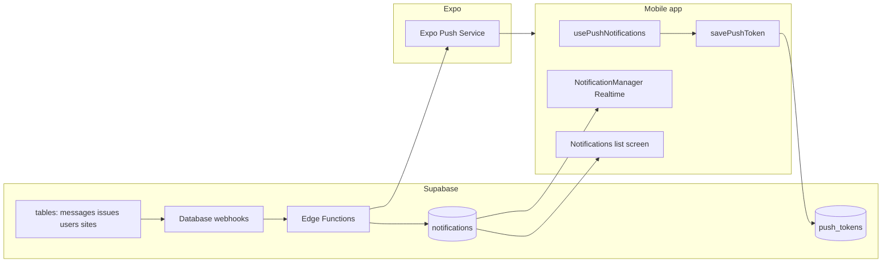

# Notifications and push

This document is the **implementation guide** for notifications in Digital Caretaker: what is shipped, how **in-app** and **push** work together, and how **Supabase Edge Functions** fit in.

**Status — implemented**

- **Notification list:** Users (caretaker, landlord, cite head) have a screen that reads rows from `public.notifications` and can open the related issue, user, or cite.
- **In-app toasts:** New rows for the signed-in user trigger a **Realtime** subscription (`NotificationManager`) that shows a short banner (“View” navigates like the list).
- **Push notifications:** Device registration saves an Expo push token to `push_tokens`. **Database webhooks** call **Edge Functions** after relevant inserts/updates; functions send pushes via **Expo’s Push API** using the **`EXPO_ACCESS_TOKEN`** secret.

Related docs:

- [Database webhooks](db/webhooks.md) — names, tables, URLs, auth header  
- [Edge Functions (per-function reference)](db/edge-functions.md) — payloads, recipients, idempotency  
- SQL for `push_tokens`, preferences, and history: [embedded in §7](#7-sql-schema-database-objects-for-edge-functions) and [`assets/documents/push/`](../assets/documents/push/)

---

## 1. End-to-end flow (mental model)



1. On login, the app requests notification permission, obtains an **Expo push token** (with EAS `projectId` for reliability when the app is killed), and stores it in **`push_tokens`** — see **§6.1–6.2** below.
2. When another part of the system inserts or updates data (e.g. a new message or issue), Supabase **webhooks** POST the event to the matching **Edge Function**.
3. The function loads recipient user IDs, respects **`user_notification_preferences`**, reads **tokens** from **`push_tokens`**, and calls Expo to deliver the notification. Some functions also **`INSERT` into `notifications`** so the in-app list and Realtime toast stay in sync — see **§4** (overview) and **§6.5** (embedded `send-issue-push` excerpt).

---

## 2. In-app notifications (persisted list + banner)

- **Source:** `public.notifications`, one row per recipient (`user_id`).
- **Types** include: `issue_created`, `issue_completed`, `landlord_added`, `site_head_added`, `site_added`, and related metadata (e.g. `related_issue_id`, `related_user_id`).
- **List UI:** Loads via `getNotifications(userId)` (and related helpers in `lib/supabase.ts`), with relative timestamps and optional related-user imagery — see **§6.4** for fetch + Realtime refresh.
- **Banner UI:** Realtime subscription maps each new row to a toast; **code is embedded in §6.3**.

**Messages:** New chat messages do **not** create `notifications` rows; they only appear under **Messages** (and via **message push**). This is intentional to avoid duplicating the chat inbox in the notification center.

---

## 3. Push notifications (device)

- **Delivery:** Expo **`expo-notifications`** on the client; **Expo Push API** from the server (Edge Functions).
- **Registration & token persistence:** **§6.1–6.2**.
- **Foreground behavior:** **`setNotificationHandler`** suppresses **alerts/sound/badge for `type === "message"`** while the app is **active** — first block in **§6.1**.
- **Tap handling:** cold start, listeners, and `switch (data.type)` routing — **§6.2**.

---

## 4. Edge Functions — how they work

All functions live under `supabase/functions/` and run on **Supabase (Deno)**. They are **HTTP handlers** (`serve(...)`). **Push-related** ones are invoked by **Database Webhooks** (not by the app directly), except **`create-user-with-site`** / **`create-caretaker`**.

**Common pattern**

1. Parse JSON body from Supabase (`record` / `old_record`).
2. Validate table and event type.
3. Supabase client with **service role** in the `Authorization` header (see **`createClient`** snippet below).
4. Optionally **`INSERT` into `notifications`**.
5. Build Expo messages and `POST` to `https://exp.host/--/api/v2/push/send` with **`EXPO_ACCESS_TOKEN`**.

**Idempotency:** e.g. `notification_history` / existing `notifications` rows so duplicate webhooks do not double-notify.

| Function | Trigger (typical) | Main job |
| -------- | ------------------- | -------- |
| **`send-message-push`** | `messages` INSERT | Push to participants except sender; **no** `notifications` row. |
| **`send-issue-push`** | `issues` INSERT | Push + **`notifications`** (`issue_created`); rules + dedupe — **§6.5**. |
| **`send-issue-update-push`** | `issues` UPDATE | Reporter notified on completion, etc. |
| **`send-new-user-push`** | **`public.users`** INSERT | Push for new landlord/cite head. |
| **`send-new-cite-push`** | `sites` INSERT | Push for new cite. |
| **`create-user-with-site`** | App HTTP | User + in-app rows; push via **`send-new-user-push`**. |
| **`create-caretaker`** | App/script | Not part of webhook push chain. |

**Deploy and secrets:** [edge-functions.md](db/edge-functions.md). Webhook targets use **`--no-verify-jwt`**; webhooks send **`Authorization: Bearer <service_role>`**.

Representative server code: **§6.5** (`send-message-push` + `send-issue-push` excerpts).

---

## 5. Who receives what (summary)

| Event | In-app (`notifications`) | Push |
| ----- | ------------------------ | ---- |
| New message | No (Messages tab only) | Yes (participants except sender; suppressed in foreground) |
| New issue | Yes (`issue_created`) | Yes (landlord + cite head; caretakers if not reporter caretaker; never creator) |
| Issue resolved | Yes (`issue_completed`) | Yes (reporter) |
| New landlord / cite head | Yes (from create flow) | Yes (`send-new-user-push`) |
| New cite | Yes (`site_added` from app) | Yes (`send-new-cite-push`) |

---

## 6. Embedded source (reference snapshots)

> These blocks mirror the current repo. Line numbers drift if you edit code; use the **file path** to find the live version.

### 6.1 `lib/pushNotifications.ts` — handler, registration, saving token

```typescript
Notifications.setNotificationHandler({
  handleNotification: async (notification) => {
    const data = (notification.request.content.data || {}) as Record<string, unknown>;
    const isMessage = data?.type === "message";
    const isAppActive = AppState.currentState === "active";
    if (isMessage && isAppActive) {
      return {
        shouldShowAlert: false,
        shouldPlaySound: false,
        shouldSetBadge: false,
      };
    }
    return {
      shouldShowAlert: true,
      shouldPlaySound: true,
      shouldSetBadge: true,
    };
  },
});

export async function registerForPushNotificationsAsync(): Promise<
  string | null
> {
  if (!Device.isDevice) {
    console.log("[PUSH] Push notifications only work on physical devices");
    return null;
  }

  try {
    if (Platform.OS === "android") {
      await Notifications.setNotificationChannelAsync("default", {
        name: "default",
        importance: Notifications.AndroidImportance.MAX,
        vibrationPattern: [0, 250, 250, 250],
        lightColor: "#007AFF",
      });
    }

    const { status: existingStatus } =
      await Notifications.getPermissionsAsync();
    let finalStatus = existingStatus;

    if (existingStatus !== "granted") {
      const { status } = await Notifications.requestPermissionsAsync();
      finalStatus = status;
    }

    if (finalStatus !== "granted") {
      console.log("[PUSH] Push notification permissions not granted");
      return null;
    }

    const projectId =
      Constants?.expoConfig?.extra?.eas?.projectId ??
      (Constants as any)?.easConfig?.projectId;

    if (!projectId) {
      console.warn(
        "[PUSH] EAS projectId not found; token may not work when app is closed. Set extra.eas.projectId in app.json.",
      );
    }

    const tokenData = await Notifications.getExpoPushTokenAsync(
      projectId ? { projectId } : undefined,
    );
    const token = tokenData.data;

    console.log("[PUSH] Push token obtained:", token.substring(0, 24) + "...");
    return token;
  } catch (error) {
    console.error("[PUSH] Error registering for push notifications:", error);
    return null;
  }
}

export async function savePushToken(
  userId: string,
  token: string,
): Promise<void> {
  try {
    const { error } = await supabase.from("push_tokens").upsert(
      {
        user_id: userId,
        token,
        device_type: Platform.OS,
        created_at: new Date().toISOString(),
      },
      {
        onConflict: "user_id,token",
      },
    );

    if (error) {
      console.error("[PUSH] Error saving push token:", error);
    } else {
      console.log("[PUSH] Push token saved successfully");
    }
  } catch (error) {
    console.error("[PUSH] Error in savePushToken:", error);
  }
}
```

### 6.2 `hooks/usePushNotifications.ts` — register, listeners, tap routing

```typescript
async function registerAndSaveToken(userId: string) {
  try {
    const token = await registerForPushNotificationsAsync();
    if (token) {
      console.log("[PUSH HOOK] Push token obtained:", token);
      await savePushToken(userId, token);
    } else {
      console.log(
        "[PUSH HOOK] No push token (permission denied or unavailable)",
      );
    }
  } catch (error) {
    console.error("[PUSH HOOK] Error setting up push notifications:", error);
  }
}

export function usePushNotifications() {
  const { userProfile } = useCurrentUserProfile();
  const responseListener = useRef<any>();

  useEffect(() => {
    let isMounted = true;
    const checkInitialNotification = async () => {
      try {
        const response = await Notifications.getLastNotificationResponseAsync();
        if (!response || !isMounted) return;
        const data = response.notification.request.content.data as any;
        setTimeout(() => handleNotificationTap(data), 500);
      } catch (e) {
        console.error("[PUSH HOOK] Error checking initial notification:", e);
      }
    };
    checkInitialNotification();
    return () => {
      isMounted = false;
    };
  }, []);

  // Also: effects for supabase.auth.onAuthStateChange, AppState "active",
  // and userProfile?.id that call registerAndSaveToken / savePushToken.

  useEffect(() => {
    if (!userProfile?.id) return;
    responseListener.current =
      Notifications.addNotificationResponseReceivedListener((response) => {
        const data = response.notification.request.content.data as any;
        handleNotificationTap(data);
      });
    return () => {
      if (responseListener.current) {
        Notifications.removeNotificationSubscription(responseListener.current);
      }
    };
  }, [userProfile?.id]);
}

function getRoleSegment(
  role: string | null,
): "caretaker" | "landlord" | "cite-head" {
  if (role === "site_head") return "cite-head";
  if (role === "landlord") return "landlord";
  return "caretaker";
}

async function handleNotificationTap(data: any) {
  if (!data || !data.type) {
    console.warn("[PUSH HOOK] Invalid notification data:", data);
    return;
  }

  try {
    let role = await getCurrentUserRole();
    if (role == null) {
      await new Promise((r) => setTimeout(r, 600));
      role = await getCurrentUserRole();
    }
    const segment = getRoleSegment(role);

    switch (data.type) {
      case "message":
        if (data.conversationId) {
          const isGroup = data.isGroup === true;
          const path = isGroup
            ? `/protected/${segment}/(stacks)/messages-${segment}/group-chat/${data.conversationId}`
            : `/protected/${segment}/(stacks)/messages-${segment}/chat/${data.conversationId}`;
          router.push(path as any);
        }
        break;

      case "issue":
        if (data.issueId) {
          router.push(
            `/protected/${segment}/(stacks)/issues-details-${segment}/${data.issueId}` as any,
          );
        }
        break;

      case "system":
        if (data.screen === "cites" && data.siteId) {
          router.push(
            `/protected/${segment}/(stacks)/cite-details-${segment}/${data.siteId}` as any,
          );
        }
        break;

      case "user_mention":
        if (data.conversationId) {
          router.push(
            `/protected/${segment}/(stacks)/messages-${segment}/chat/${data.conversationId}` as any,
          );
        }
        break;

      default:
        console.log("[PUSH HOOK] Unknown notification type:", data.type);
    }
  } catch (error) {
    console.error("[PUSH HOOK] Error handling notification tap:", error);
  }
}
```

In the **actual** file, token refresh and both notification listeners share one `useEffect` keyed on `userProfile?.id`; the snippet above splits cold-start handling from tap handling for readability. The repo also registers tokens on auth change, on `AppState` **active**, and uses `lastRegisteredUserId` to avoid redundant work — see `hooks/usePushNotifications.ts` in full.

### 6.3 `components/commons/notifications/NotificationManager.tsx` — Realtime → toast

```typescript
useEffect(() => {
  if (!userProfile?.id) return;

  const channel = supabase
    .channel("in_app_notifications")
    .on(
      "postgres_changes",
      {
        event: "INSERT",
        schema: "public",
        table: "notifications",
        filter: `user_id=eq.${userProfile.id}`,
      },
      (payload) => {
        const newNotification = payload.new as any;

        if (newNotification?.id) {
          if (seenNotificationIdsRef.current.has(newNotification.id)) {
            return;
          }
          seenNotificationIdsRef.current.add(newNotification.id);
        }

        const inAppNotification: Omit<InAppNotificationData, "id"> = {
          type:
            newNotification.type === "issue_created"
              ? "issue"
              : newNotification.type === "issue_completed"
                ? "success"
                : "info",
          title: getNotificationTitle(newNotification.type),
          message: newNotification.message,
          actionText: "View",
          onAction: () => handleNotificationAction(newNotification),
          autoHide: true,
          duration: 6000,
        };

        showNotification(inAppNotification);
      },
    )
    .subscribe();

  return () => {
    supabase.removeChannel(channel);
  };
}, [userProfile?.id]);
```

```typescript
const handleNotificationAction = async (dbNotification: any) => {
  switch (dbNotification.type) {
    case "issue_created":
    case "issue_completed":
      if (dbNotification.related_issue_id) {
        const route = await getIssueDetailsRoute(
          dbNotification.related_issue_id,
        );
        if (route) {
          router.push(route as any);
        }
      }
      break;
    case "role_assigned":
    case "role_removed":
      break;
  }
};
```

### 6.4 `components/commons/notifications/NotificationsListScreen.tsx` — load list + Realtime refresh

```typescript
const fetchNotifications = useCallback(async (isRefresh = false) => {
  try {
    if (isRefresh) {
      setRefreshing(true);
    } else {
      setLoading(true);
    }
    setError("");

    const { data: userRes } = await supabase.auth.getUser();
    const uid = userRes.user?.id as string | undefined;
    if (!uid) {
      setNotifications([]);
      return;
    }

    const { data, error } = await getNotifications(uid);
    if (error) throw error;

    const list = (data || []) as NotificationRow[];
    setNotifications(list);
    // … loads related_user_id profile images for row avatars …
  } catch (e: any) {
    console.error("Error fetching notifications:", e);
    setError("Failed to load notifications.");
  } finally {
    setLoading(false);
    setRefreshing(false);
  }
}, []);

useEffect(() => {
  let isMounted = true;
  let sub: any;

  (async () => {
    try {
      const { data: userRes } = await supabase.auth.getUser();
      const uid = userRes.user?.id as string | undefined;
      if (!uid || !isMounted) return;

      await fetchNotifications();

      sub = subscribeToNotifications(uid, () => {
        fetchNotifications(true);
      });
    } catch (e) {
      console.error("Notifications subscription error:", e);
    }
  })();

  return () => {
    isMounted = false;
    if (sub) {
      supabase.removeChannel(sub as any);
    }
  };
}, [fetchNotifications]);
```

### 6.5 Edge Functions — `send-message-push` and `send-issue-push` (excerpts)

**Supabase client (service role)** — same pattern in push functions:

```typescript
const EXPO_ACCESS_TOKEN = Deno.env.get("EXPO_ACCESS_TOKEN");

const supabase = createClient(
  Deno.env.get("SUPABASE_URL") ?? "",
  Deno.env.get("SUPABASE_ANON_KEY") ?? "",
  {
    global: {
      headers: {
        Authorization: `Bearer ${Deno.env.get("SUPABASE_SERVICE_ROLE_KEY")}`,
      },
    },
  },
);
```

**`send-message-push` — recipients, preferences, title/body, Expo API** (abridged; omits idempotency + error branches)

```typescript
serve(async (req) => {
  try {
    const payload: WebhookPayload = await req.json();

    if (payload.type !== "INSERT" || payload.table !== "messages") {
      return new Response("Event type not supported", { status: 400 });
    }

    const message = payload.record;

    const { data: participants } = await supabase
      .from("conversation_participants")
      .select("user_id")
      .eq("conversation_id", message.conversation_id)
      .neq("user_id", message.sender_id);

    const recipientIds = [...new Set((participants ?? []).map((p) => p.user_id))];

    const { data: sender } = await supabase
      .from("users")
      .select("name")
      .eq("id", message.sender_id)
      .single();

    const { data: tokens } = await supabase
      .from("push_tokens")
      .select("token, user_id")
      .in("user_id", recipientIds);

    const { data: preferences } = await supabase
      .from("user_notification_preferences")
      .select("user_id, new_messages")
      .in("user_id", recipientIds)
      .eq("new_messages", true);

    const allowedUserIds =
      preferences && preferences.length > 0
        ? preferences.map((p) => p.user_id)
        : recipientIds;
    const filteredTokens = (tokens ?? []).filter((token) =>
      allowedUserIds.includes(token.user_id),
    );

    const senderName = sender?.name || "Someone";
    const messagePreview =
      message.content && message.content.trim()
        ? message.content.length > 100
          ? message.content.substring(0, 100).trim() + "..."
          : message.content.trim()
        : (message.media_caption && message.media_caption.trim()) ||
          "Sent an image";

    const { data: conversation } = await supabase
      .from("conversations")
      .select("name, is_group")
      .eq("id", message.conversation_id)
      .single();

    let title: string;
    let body: string;
    if (conversation?.is_group && conversation.name) {
      title = `${senderName} in ${conversation.name}`;
      body = messagePreview;
    } else {
      title = `Message from ${senderName}`;
      body = messagePreview;
    }

    const expoMessages = filteredTokens.map((token) => ({
      to: token.token,
      sound: "default" as const,
      title,
      body,
      data: {
        type: "message",
        conversationId: message.conversation_id,
        messageId: message.id,
        senderId: message.sender_id,
        senderName: senderName,
        isGroup: conversation?.is_group ?? false,
      },
      priority: "high" as const,
      channelId: "default",
    }));

    const response = await fetch("https://exp.host/--/api/v2/push/send", {
      method: "POST",
      headers: {
        Accept: "application/json",
        "Accept-encoding": "gzip, deflate",
        "Content-Type": "application/json",
        ...(EXPO_ACCESS_TOKEN && {
          Authorization: `Bearer ${EXPO_ACCESS_TOKEN}`,
        }),
      },
      body: JSON.stringify(expoMessages),
    });
    // Production code chunks messages (max 100 per request) and records notification_history.
  } catch (err) {
    console.error(err);
    return new Response("Error", { status: 500 });
  }
});
```

**`send-issue-push` — recipients, in-app inserts, push idempotency** (abridged)

```typescript
const creatorRole = reporterUser?.role || null;
const recipientIds: string[] = [];

if (site.landlord_id && site.landlord_id !== creatorId) {
  recipientIds.push(site.landlord_id);
}
if (site.site_head_id && site.site_head_id !== creatorId) {
  recipientIds.push(site.site_head_id);
}

if (creatorRole !== "caretaker") {
  const { data: caretakers } = await supabase
    .from("users")
    .select("id")
    .eq("role", "caretaker");
  const caretakerIds = (caretakers || []).map((c) => c.id).filter(Boolean);
  for (const id of caretakerIds) {
    if (id !== creatorId && !recipientIds.includes(id)) {
      recipientIds.push(id);
    }
  }
}

const recipientIdsFiltered = [...new Set(recipientIds)];

const { data: existingNotifs } = await supabase
  .from("notifications")
  .select("user_id")
  .eq("related_issue_id", issue.id)
  .eq("type", "issue_created");
const alreadyNotifiedUserIds = new Set((existingNotifs || []).map((r) => r.user_id));
const recipientsToNotify = recipientIdsFiltered.filter(
  (id) => !alreadyNotifiedUserIds.has(id),
);

if (recipientsToNotify.length > 0) {
  const inAppNotifications = recipientsToNotify.map((user_id) => ({
    user_id,
    type: "issue_created",
    message: messageText,
    related_issue_id: issue.id,
    is_read: false,
  }));
  await supabase.from("notifications").insert(inAppNotifications);
}

const { data: existingPush } = await supabase
  .from("notification_history")
  .select("id")
  .eq("related_id", issue.id)
  .eq("type", "issue")
  .limit(1);
if (existingPush && existingPush.length > 0) {
  return new Response(
    JSON.stringify({ success: true, skipped: "already_sent" }),
    { status: 200 },
  );
}

// … fetch push_tokens, filter by user_notification_preferences.new_issues, POST to Expo …
```

---

## 7. SQL schema (database objects for Edge Functions)

Push Edge Functions are **TypeScript**; they talk to **Postgres** through the Supabase client with the **service role** (RLS is bypassed). **Invoking** them on insert/update is done with **Database Webhooks** in the Supabase Dashboard (URLs + `Authorization` header), not with SQL — see [webhooks.md](db/webhooks.md).

The in-app table **`public.notifications`** is assumed to exist as part of the core app (not defined in these scripts). Functions insert rows using at least `user_id`, `type`, `message`, `related_issue_id`, and `is_read`.

### 7.1 Tables used by push-related Edge Functions

| Function | Main tables |
| -------- | ----------- |
| `send-message-push` | `messages` (payload), `conversation_participants`, `users`, `conversations`, `push_tokens`, `user_notification_preferences`, `notification_history` |
| `send-issue-push` | `issues`, `sites`, `users`, `notifications`, `push_tokens`, `user_notification_preferences`, `notification_history` |
| `send-issue-update-push` | `issues`, `push_tokens`, `user_notification_preferences`, `notifications`, `notification_history` |
| `send-new-user-push` | `users`, `sites`, `push_tokens`, `notification_history` |
| `send-new-cite-push` | `users`, `push_tokens`, `notification_history` |

Scripts below create **`push_tokens`**, **`user_notification_preferences`**, and **`notification_history`**.

### 7.2 `assets/documents/push/push-notifications-setup-minimal.sql`

Tables and indexes **without RLS** — matches all `notification_history.type` values used in Edge Functions (`message`, `issue`, `issue_update`, `new_landlord`, `new_cite_head`, `new_cite`, etc.). Prefer this if you need idempotency logging without fighting a narrow `CHECK` on `type`.

```sql
-- Push Notifications – MINIMAL setup (tables + indexes only, NO RLS)
-- Use this first to get push working; add RLS later with push-notifications-setup.sql or the RLS section below.
-- Run in Supabase SQL Editor.

-- =================================================
-- TABLES
-- =================================================

CREATE TABLE IF NOT EXISTS push_tokens (
  id uuid PRIMARY KEY DEFAULT gen_random_uuid(),
  user_id uuid REFERENCES users(id) ON DELETE CASCADE,
  token text NOT NULL,
  device_type text NOT NULL CHECK (device_type IN ('ios', 'android', 'web')),
  created_at timestamp with time zone DEFAULT now(),
  updated_at timestamp with time zone DEFAULT now(),
  UNIQUE(user_id, token)
);

CREATE TABLE IF NOT EXISTS user_notification_preferences (
  id uuid PRIMARY KEY DEFAULT gen_random_uuid(),
  user_id uuid REFERENCES users(id) ON DELETE CASCADE,
  new_messages boolean DEFAULT true,
  new_issues boolean DEFAULT true,
  issue_updates boolean DEFAULT true,
  created_at timestamp with time zone DEFAULT now(),
  updated_at timestamp with time zone DEFAULT now(),
  UNIQUE(user_id)
);

-- Optional: for logging/analytics
CREATE TABLE IF NOT EXISTS notification_history (
  id uuid PRIMARY KEY DEFAULT gen_random_uuid(),
  user_id uuid REFERENCES users(id) ON DELETE CASCADE,
  type text NOT NULL,
  title text NOT NULL,
  body text,
  related_id uuid,
  sent_at timestamp with time zone DEFAULT now()
);

-- =================================================
-- INDEXES
-- =================================================

CREATE INDEX IF NOT EXISTS idx_push_tokens_user_id ON push_tokens(user_id);
CREATE INDEX IF NOT EXISTS idx_push_tokens_token ON push_tokens(token);
CREATE INDEX IF NOT EXISTS idx_notification_preferences_user_id ON user_notification_preferences(user_id);

-- =================================================
-- LATER: ADD RLS (run when you want to lock down access)
-- =================================================
-- Uncomment and run when ready. RLS ensures:
-- - App users can only read/insert/update/delete their own push_tokens and preferences.
-- - The edge function uses SERVICE_ROLE_KEY so it bypasses RLS when reading push_tokens.
/*
ALTER TABLE push_tokens ENABLE ROW LEVEL SECURITY;
ALTER TABLE user_notification_preferences ENABLE ROW LEVEL SECURITY;

CREATE POLICY "Users own push_tokens" ON push_tokens FOR ALL USING (auth.uid() = user_id) WITH CHECK (auth.uid() = user_id);
CREATE POLICY "Users own preferences" ON user_notification_preferences FOR ALL USING (auth.uid() = user_id) WITH CHECK (auth.uid() = user_id);
*/
```

**Note:** On React Native, `device_type` from the app may be the raw platform string (e.g. `android` / `ios`). If inserts fail the `CHECK`, align the app or widen the constraint.

### 7.3 `assets/documents/push/push-notifications-setup.sql` (full optional setup)

Extended DDL with **RLS**, helper routines, triggers, and a stricter `notification_history.type` check. If you use this file as-is, **`notification_history` may reject** rows where Edge Functions set `type` to `new_landlord`, `new_cite_head`, or `new_cite` — extend the `CHECK` or use **minimal** for `notification_history` only.

```sql
-- Push Notifications Database Setup for Digital Caretaker
-- Run this script to add push notification support to your Supabase database

-- =================================================
-- PUSH NOTIFICATION TABLES
-- =================================================

-- Table to store push tokens for users
CREATE TABLE IF NOT EXISTS push_tokens (
  id uuid PRIMARY KEY DEFAULT gen_random_uuid(),
  user_id uuid REFERENCES users(id) ON DELETE CASCADE,
  token text NOT NULL,
  device_type text NOT NULL CHECK (device_type IN ('ios', 'android', 'web')),
  created_at timestamp with time zone DEFAULT now(),
  updated_at timestamp with time zone DEFAULT now(),

  -- Ensure one token per user per device type
  UNIQUE(user_id, token)
);

-- Table for user notification preferences
CREATE TABLE IF NOT EXISTS user_notification_preferences (
  id uuid PRIMARY KEY DEFAULT gen_random_uuid(),
  user_id uuid REFERENCES users(id) ON DELETE CASCADE,
  new_messages boolean DEFAULT true,
  new_issues boolean DEFAULT true,
  issue_updates boolean DEFAULT true,
  created_at timestamp with time zone DEFAULT now(),
  updated_at timestamp with time zone DEFAULT now(),

  -- One preference record per user
  UNIQUE(user_id)
);

-- Table for notification history (optional, for analytics)
CREATE TABLE IF NOT EXISTS notification_history (
  id uuid PRIMARY KEY DEFAULT gen_random_uuid(),
  user_id uuid REFERENCES users(id) ON DELETE CASCADE,
  type text NOT NULL CHECK (type IN ('message', 'issue', 'issue_update', 'system')),
  title text NOT NULL,
  body text,
  related_id uuid, -- conversation_id or issue_id
  sent_at timestamp with time zone DEFAULT now(),
  delivered_at timestamp with time zone,
  read_at timestamp with time zone
);

-- =================================================
-- INDEXES FOR PERFORMANCE
-- =================================================

-- Indexes for push_tokens
CREATE INDEX IF NOT EXISTS idx_push_tokens_user_id ON push_tokens(user_id);
CREATE INDEX IF NOT EXISTS idx_push_tokens_token ON push_tokens(token);

-- Indexes for user_notification_preferences
CREATE INDEX IF NOT EXISTS idx_notification_preferences_user_id ON user_notification_preferences(user_id);

-- Indexes for notification_history
CREATE INDEX IF NOT EXISTS idx_notification_history_user_id ON notification_history(user_id);
CREATE INDEX IF NOT EXISTS idx_notification_history_type ON notification_history(type);
CREATE INDEX IF NOT EXISTS idx_notification_history_related_id ON notification_history(related_id);
CREATE INDEX IF NOT EXISTS idx_notification_history_sent_at ON notification_history(sent_at DESC);

-- =================================================
-- ROW LEVEL SECURITY POLICIES
-- =================================================

-- Enable RLS on all tables
ALTER TABLE push_tokens ENABLE ROW LEVEL SECURITY;
ALTER TABLE user_notification_preferences ENABLE ROW LEVEL SECURITY;
ALTER TABLE notification_history ENABLE ROW LEVEL SECURITY;

-- Push tokens policies
CREATE POLICY "Users can view their own push tokens" ON push_tokens
FOR SELECT USING (auth.uid() = user_id);

CREATE POLICY "Users can insert their own push tokens" ON push_tokens
FOR INSERT WITH CHECK (auth.uid() = user_id);

CREATE POLICY "Users can update their own push tokens" ON push_tokens
FOR UPDATE USING (auth.uid() = user_id);

CREATE POLICY "Users can delete their own push tokens" ON push_tokens
FOR DELETE USING (auth.uid() = user_id);

-- Notification preferences policies
CREATE POLICY "Users can view their own notification preferences" ON user_notification_preferences
FOR SELECT USING (auth.uid() = user_id);

CREATE POLICY "Users can insert their own notification preferences" ON user_notification_preferences
FOR INSERT WITH CHECK (auth.uid() = user_id);

CREATE POLICY "Users can update their own notification preferences" ON user_notification_preferences
FOR UPDATE USING (auth.uid() = user_id);

-- Notification history policies (users can only see their own notifications)
CREATE POLICY "Users can view their own notification history" ON notification_history
FOR SELECT USING (auth.uid() = user_id);

-- =================================================
-- FUNCTIONS FOR NOTIFICATION MANAGEMENT
-- =================================================

-- Function to clean up old push tokens (run periodically)
CREATE OR REPLACE FUNCTION cleanup_old_push_tokens()
RETURNS integer
LANGUAGE plpgsql
SECURITY DEFINER
AS $$
DECLARE
  deleted_count integer;
BEGIN
  -- Delete tokens older than 90 days that haven't been updated
  DELETE FROM push_tokens
  WHERE updated_at < now() - interval '90 days';

  GET DIAGNOSTICS deleted_count = ROW_COUNT;
  RETURN deleted_count;
END;
$$;

-- Function to get active push tokens for a user
CREATE OR REPLACE FUNCTION get_active_push_tokens(user_uuid uuid)
RETURNS TABLE(token text, device_type text)
LANGUAGE plpgsql
SECURITY DEFINER
AS $$
BEGIN
  RETURN QUERY
  SELECT pt.token, pt.device_type
  FROM push_tokens pt
  WHERE pt.user_id = user_uuid
  AND pt.updated_at > now() - interval '30 days'; -- Consider tokens active for 30 days
END;
$$;

-- Function to log notification delivery
CREATE OR REPLACE FUNCTION log_notification_delivery(
  p_user_id uuid,
  p_type text,
  p_title text,
  p_body text DEFAULT NULL,
  p_related_id uuid DEFAULT NULL
)
RETURNS uuid
LANGUAGE plpgsql
SECURITY DEFINER
AS $$
DECLARE
  notification_id uuid;
BEGIN
  INSERT INTO notification_history (user_id, type, title, body, related_id, sent_at)
  VALUES (p_user_id, p_type, p_title, p_body, p_related_id, now())
  RETURNING id INTO notification_id;

  RETURN notification_id;
END;
$$;

-- =================================================
-- TRIGGERS FOR AUTOMATIC UPDATES
-- =================================================

-- Trigger to update updated_at timestamp on push_tokens
CREATE OR REPLACE FUNCTION update_push_tokens_updated_at()
RETURNS trigger
LANGUAGE plpgsql
AS $$
BEGIN
  NEW.updated_at = now();
  RETURN NEW;
END;
$$;

CREATE TRIGGER trigger_push_tokens_updated_at
  BEFORE UPDATE ON push_tokens
  FOR EACH ROW
  EXECUTE FUNCTION update_push_tokens_updated_at();

-- Trigger to update updated_at timestamp on user_notification_preferences
CREATE OR REPLACE FUNCTION update_notification_preferences_updated_at()
RETURNS trigger
LANGUAGE plpgsql
AS $$
BEGIN
  NEW.updated_at = now();
  RETURN NEW;
END;
$$;

CREATE TRIGGER trigger_notification_preferences_updated_at
  BEFORE UPDATE ON user_notification_preferences
  FOR EACH ROW
  EXECUTE FUNCTION update_notification_preferences_updated_at();

-- =================================================
-- DATA MIGRATION HELPERS
-- =================================================

-- Insert default notification preferences for existing users
INSERT INTO user_notification_preferences (user_id, new_messages, new_issues, issue_updates)
SELECT
  u.id,
  true, -- new_messages
  true, -- new_issues
  true  -- issue_updates
FROM users u
WHERE NOT EXISTS (
  SELECT 1 FROM user_notification_preferences unp WHERE unp.user_id = u.id
);

-- =================================================
-- SETUP COMPLETE
-- =================================================

DO $$
BEGIN
  RAISE NOTICE 'Push notifications database setup completed successfully!';
  RAISE NOTICE 'Created tables: push_tokens, user_notification_preferences, notification_history';
  RAISE NOTICE 'Created functions: cleanup_old_push_tokens, get_active_push_tokens, log_notification_delivery';
  RAISE NOTICE 'Created indexes and RLS policies for security';
END $$;
```

### 7.4 `assets/documents/rls/fix-notifications-rls-policy.sql`

Realtime publication entries and permissive RLS on **`notifications`** for authenticated clients (in-app list + inserts from the app).

```sql
-- Minimal SQL to allow full access to notifications for authenticated users
-- This allows creating notifications when adding landlords or sites

-- Ensure RLS is enabled on the table
ALTER TABLE notifications ENABLE ROW LEVEL SECURITY;

-- Enable real-time replication for necessary tables
-- This is necessary for the app to receive instant updates
-- Note: These commands will fail gracefully if tables are already in the publication

DO $$
BEGIN
    -- Add tables to real-time publication (ignore if already exists)
    BEGIN
        ALTER PUBLICATION supabase_realtime ADD TABLE issues;
    EXCEPTION WHEN OTHERS THEN
        RAISE NOTICE 'Table issues already in publication or publication does not exist';
    END;

    BEGIN
        ALTER PUBLICATION supabase_realtime ADD TABLE notifications;
    EXCEPTION WHEN OTHERS THEN
        RAISE NOTICE 'Table notifications already in publication or publication does not exist';
    END;

    BEGIN
        ALTER PUBLICATION supabase_realtime ADD TABLE messages;
    EXCEPTION WHEN OTHERS THEN
        RAISE NOTICE 'Table messages already in publication or publication does not exist';
    END;

    BEGIN
        ALTER PUBLICATION supabase_realtime ADD TABLE message_read_receipts;
    EXCEPTION WHEN OTHERS THEN
        RAISE NOTICE 'Table message_read_receipts already in publication or publication does not exist';
    END;

    BEGIN
        ALTER PUBLICATION supabase_realtime ADD TABLE sites;
    EXCEPTION WHEN OTHERS THEN
        RAISE NOTICE 'Table sites already in publication or publication does not exist';
    END;

    BEGIN
        ALTER PUBLICATION supabase_realtime ADD TABLE users;
    EXCEPTION WHEN OTHERS THEN
        RAISE NOTICE 'Table users already in publication or publication does not exist';
    END;
END $$;

-- Drop and recreate Full access policies
DROP POLICY IF EXISTS "Full access SELECT" ON notifications;
CREATE POLICY "Full access SELECT" ON notifications FOR SELECT TO authenticated USING (true);

DROP POLICY IF EXISTS "Full access INSERT" ON notifications;
CREATE POLICY "Full access INSERT" ON notifications FOR INSERT TO authenticated WITH CHECK (true);

DROP POLICY IF EXISTS "Full access UPDATE" ON notifications;
CREATE POLICY "Full access UPDATE" ON notifications FOR UPDATE TO authenticated USING (true) WITH CHECK (true);

DROP POLICY IF EXISTS "Full access DELETE" ON notifications;
CREATE POLICY "Full access DELETE" ON notifications FOR DELETE TO authenticated USING (true);
```

### 7.5 `assets/documents/migrations/notifications-cascade-on-delete.sql`

```sql
-- Migration: Notifications ON DELETE CASCADE
-- Run in Supabase SQL Editor.
-- When an issue or user is deleted, related notifications are deleted automatically.

-- 1) related_issue_id → issues(id)
ALTER TABLE public.notifications
  DROP CONSTRAINT IF EXISTS notifications_related_issue_id_fkey;

ALTER TABLE public.notifications
  ADD CONSTRAINT notifications_related_issue_id_fkey
  FOREIGN KEY (related_issue_id)
  REFERENCES public.issues (id)
  ON DELETE CASCADE;

-- 2) user_id → users(id)
ALTER TABLE public.notifications
  DROP CONSTRAINT IF EXISTS notifications_user_id_fkey;

ALTER TABLE public.notifications
  ADD CONSTRAINT notifications_user_id_fkey
  FOREIGN KEY (user_id)
  REFERENCES public.users (id)
  ON DELETE CASCADE;
```

### 7.6 `assets/documents/migrations/notifications-dedupe-issue-created.sql`

```sql
-- Migration: Prevent duplicate issue_created notifications
-- Run in Supabase SQL Editor.
-- 1) Remove duplicate notifications (keep the oldest per user+issue)
-- 2) Add unique constraint to prevent future duplicates

-- Step 1: Delete duplicates, keeping the row with the earliest created_at
DELETE FROM public.notifications n1
USING public.notifications n2
WHERE n1.type = 'issue_created'
  AND n2.type = 'issue_created'
  AND n1.related_issue_id IS NOT NULL
  AND n2.related_issue_id IS NOT NULL
  AND n1.user_id = n2.user_id
  AND n1.related_issue_id = n2.related_issue_id
  AND n1.id > n2.id;

-- Step 2: Add unique partial index (only for issue_created with related_issue_id)
-- This prevents inserting duplicate (user_id, related_issue_id) for issue_created
CREATE UNIQUE INDEX IF NOT EXISTS notifications_issue_created_user_issue_unique
  ON public.notifications (user_id, related_issue_id)
  WHERE type = 'issue_created' AND related_issue_id IS NOT NULL;
```

---

## 8. Other files (not fully inlined)

- **`NotificationsListScreen`** — tap handlers per `notification.type` and mark-as-read live in the same file beyond **§6.4**.
- **`send-issue-update-push`**, **`send-new-user-push`**, **`send-new-cite-push`**, **`create-user-with-site`** — see [`docs/db/edge-functions.md`](db/edge-functions.md) and `supabase/functions/*/`.
